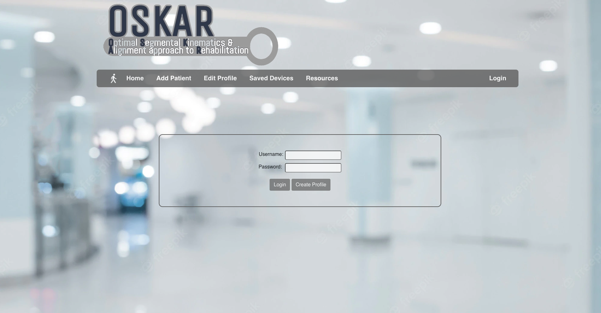
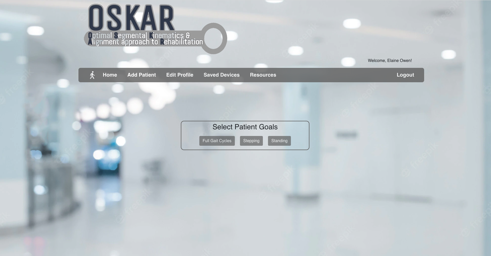
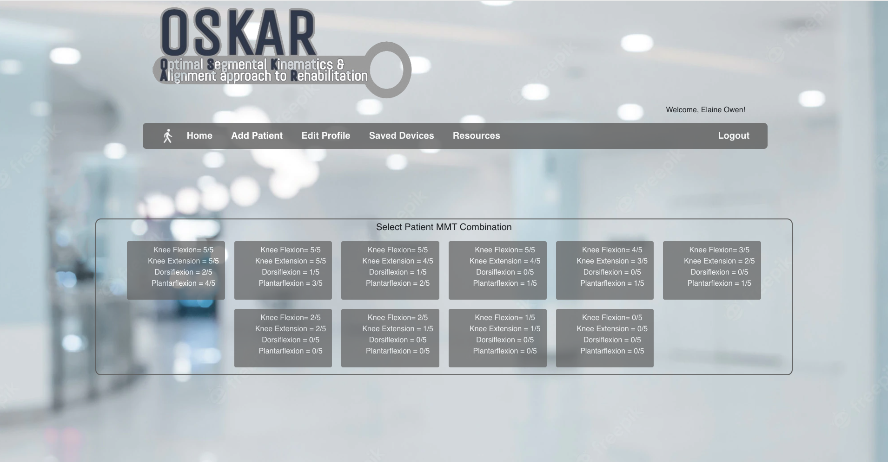
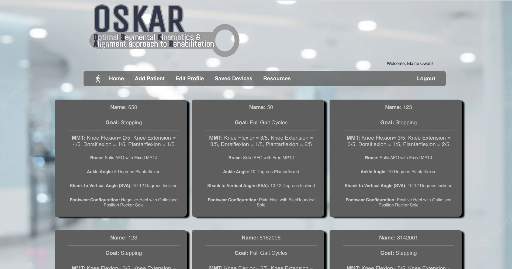
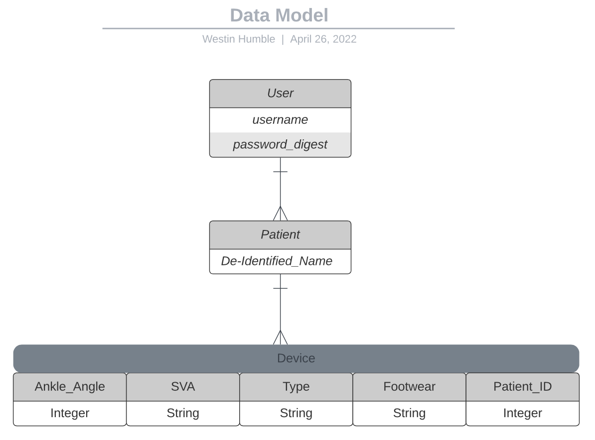

# OSKAR (Optimal Segmental Kinematics and Alignment Approach to Rehabilitation)

Based entirely on the comprehensive work of Elaine Owen MBE, MSc, SRP, MCSP. This web application is designed for healthcare practitioners to formulate orthotic brace configurations based on the highest/most current standards of evidence based practice. Upon selecting patient presentation(s), a brace configuration is algorithmically returned and saved to a healthcare practitioner.


## Description

This web application is designed for healthcare practitioners (Orthotists/Physical Therapists) to quickly and accurately return orthotic brace configurations based on patient presentation and the methodology derived and compiled by Elaine Owen MBE, MSc, SRP, MCSP. 

Healthcare practitioners can create their profile and log in using their provided credentials:

 

Patients can then be created using deindentified information, and patient presentation is then selected based on healthcare practitioner clinical findings:
 
 

 Orthotic brace recommendations are then returned based on selected patient presentation and saved to the healthcare practitioner's profile:

 

 Additional functionality includes a Resources section that links to all of Elaine Owen's publicly available published works as well as healthcare practitioner login credential modification.

 Stack: 
 - Ruby on Rails
 - PostreSQL
 - Bcrypt
 - React.js
 - React Bootstrap

 Data Model:




## Getting Started

### Dependencies

* node.js
* react: "^17.0.2"
* react-dom: "^17.0.2"
* react-bootstrap: "^2.3.1"
* react-router-dom: "^6.2.2"
* react-scripts: "4.0.3"
* bootstrap: "^5.1.3"
* web-vitals": "^1.1.2"
* @testing-library/jest-dom: "^5.13.0"
* @testing-library/react: "^11.2.7"
* @testing-library/user-event: "^12.8.3"
* Ruby "2.7.4"
* Rails: '~> 6.1.3', '>= 6.1.3.2'
* PostreSQL: '~> 1.1'
* Puma: '~> 5.0'
* Bcrypt: '~> 3.1.7'
* Bootsnap: '>= 1.4.4'
* Active Model Serializers: "~> 0.10.12"


### Installing

#### **Clone this repository**
```
git clone https://github.com/wwwestin/OSKAR.git
```

### Executing program

```
npm install
```

```
bundle install
```

```
db:create
```

```
rails s
```

```
npm start
```

## Help

Any advise for common problems or issues.
```
command to run if program contains helper info
```

## Authors

Contributors names and contact info

ex. Dominique Pizzie  
ex. [@DomPizzie](https://twitter.com/dompizzie)

## Version History

* 0.2
    * Various bug fixes and optimizations
    * See [commit change]() or See [release history]()
* 0.1
    * Initial Release

## License

This project is licensed under the [NAME HERE] License - see the LICENSE.md file for details

## Acknowledgments

* 
